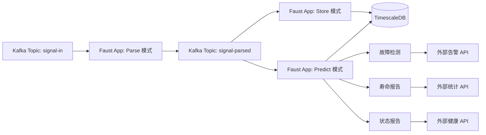

# Faust 实现分析：旧版 Python 系统

> **目的**: 分析现有基于 Python Faust 的 MACDA-NB67 HVAC 数据处理系统，为 Redpanda Connect 迁移策略提供依据。

---

## 目录

- [执行摘要](#执行摘要)
- [系统架构](#系统架构)
- [数据管道详解](#数据管道详解)
- [关键实现模式](#关键实现模式)
- [Faust vs Redpanda Connect 对比](#faust-vs-redpanda-connect-对比)
- [迁移考虑因素](#迁移考虑因素)

---

## 执行摘要

现有的 MACDA-NB67 系统是一个**基于 Faust 的流处理应用**，用于处理地铁列车 HVAC 系统的二进制遥测数据。系统处理来自 560 条消息/秒的数据流，实现以下功能：

- **二进制解析**：使用 Kaitai Struct 解析 NB67 格式（200+ 字段）
- **三种独立运行模式**：Parse（解析）、Store（存储）、Predict（预测）
- **批量操作**：使用 PostgreSQL COPY 协议与 TimescaleDB 进行批量插入
- **复杂故障检测**：实时告警功能
- **预测分析**：使用时间窗口聚合
- **外部系统集成**：告警、统计和健康报告

**关键挑战**：系统紧密耦合，单一 Python 进程处理解析、存储、预测和告警。迁移到 Redpanda Connect 需要仔细分解，同时保持业务逻辑。

---

## 系统架构

### 高层架构



### 组件概览

| 组件 | 技术栈 | 用途 |
|------|--------|------|
| **流处理器** | Faust 0.10+ | Kafka Streams 处理 |
| **二进制解析器** | Kaitai Struct | NB67 二进制格式解析 |
| **数据库** | TimescaleDB (PostgreSQL) | 时序数据存储 |
| **消息代理** | Apache Kafka | 数据流传输 |
| **Schema Registry** | Confluent Schema Registry | Schema 管理（部分使用）|
| **批量插入** | pgcopy (PostgreSQL COPY) | 高性能批量插入 |

---

## 数据管道详解

### 运行模式

Faust 应用根据 `RUN_MODE` 环境变量动态选择管道模块：

| 模式 | 管道模块 | 用途 |
|------|---------|------|
| **Parse** | `pipeline.batchparse` | 二进制 NB67 转换为 JSON |
| **Store** | `pipeline.batchstore` | 批量插入解析数据到 TimescaleDB |
| **Predict** | `pipeline.status`<br/>`pipeline.lifereport`<br/>`pipeline.predict`<br/>`pipeline.faultreport` | 故障检测、预测分析、外部报告 |

### 管道模块详解

#### 1. `batchparse` - 二进制解析代理

[batchparse/agents.py](file:///config/CozyProjects/Macda-Connector/oldproj/MACDA-NB67/pipeline/batchparse/agents.py)

**输入**: `signal-in` (二进制或 JSON 包装的二进制)  
**输出**: `signal-parsed` (带 schema 的结构化 JSON)

```python
@app.agent(input_topic)
async def parse_signal(stream):
    async for datas in stream.take(BATCH_SIZE, within=BATCH_TIME):
        for data in datas:
            # 使用 Kaitai Struct 解析二进制
            parsed_dict = Nb67.from_bytes_to_dict(data)
            
            # 包装成 schema 信封
            out_record = {"schema": jschema, "payload": parsed_dict}
            
            # 发送到解析主题
            await output_topic.send(key=key, value=out_record)
            
            # 归档到设备专属主题
            archive_topic = f"MACDA-archive-{PARSED_TOPIC}-{device_no}"
            await archive_topic.send(key=key, value=out_record)
```

**关键特性**：
- 批量消费（可配置批次大小/时间）
- 支持原始二进制和 JSON 包装的二进制输入
- 设备专属归档主题（例如 `MACDA-archive-signal-parsed-7002001`）
- 双时间戳支持：设备时间（`msg_calc_dvc_time`）和解析时间（`msg_calc_parse_time`）

---

#### 2. `batchstore` - TimescaleDB 批量插入

[batchstore/agents.py](file:///config/CozyProjects/Macda-Connector/oldproj/MACDA-NB67/pipeline/batchstore/agents.py)

**输入**: `signal-parsed`  
**输出**: TimescaleDB 批量插入

```python
@app.agent(input_topic)
async def store_signal(stream):
    tu = TSutil()
    async for datas in stream.take(TSDB_BATCH, within=TSDB_BATCH_TIME):
        # 批次大小：200 条消息 或 10 秒（以先到者为准）
        if dev_mode:
            tu.batchinsert('dev_macda', 'msg_calc_parse_time', datas)
        else:
            tu.batchinsert('pro_macda', 'msg_calc_dvc_time', datas)
```

**关键实现** ([tsutil.py:139-169](file:///config/CozyProjects/Macda-Connector/oldproj/MACDA-NB67/utils/tsutil.py#L139-L169))：

```python
def batchinsert(self, tablename, timefieldname, jsonobjlst):
    # 从第一条记录提取列名
    cols = [key for key in jsonobj.items() if key not in ignorekeys]
    
    # 构建记录列表
    records = []
    for jsonobj in jsonobjlst:
        record = [value for key, value in jsonobj['payload'].items()]
        records.append(record)
    
    # 使用 PostgreSQL COPY 进行高性能批量插入
    mgr = CopyManager(conn, tablename, cols)
    mgr.copy(records)
```

**性能**：使用 PostgreSQL COPY 协议通过 `pgcopy` 库（比单条 INSERT 快 10-100 倍）

---

#### 3. `predict` - 预测分析代理

[predict/agents.py](file:///config/CozyProjects/Macda-Connector/oldproj/MACDA-NB67/pipeline/predict/agents.py)

**输入**: `signal-parsed`  
**输出**: 预测结果 → TimescaleDB `pro_predict` / `dev_predict` 表

```python
@app.agent(input_topic)
async def store_signal(stream):
    tu = TSutil()
    predictcounter = Counter()  # 跟踪每个设备的调用次数
    
    async for data in stream:
        device_no = data['payload']['msg_calc_dvc_no']
        predictcounter[device_no] += 1
        
        # 每 PREDICT_SKIP_BATCH 条消息运行一次预测（默认：180）
        if predictcounter[device_no] > PREDICT_SKIP_BATCH:
            predictdata = tu.predict(mode, device_no)
            tu.insert_predictdata('dev_predict', predictdata)
            predictcounter[device_no] = 0
```

**预测算法** ([tsutil.py:573-757](file:///config/CozyProjects/Macda-Connector/oldproj/MACDA-NB67/utils/tsutil.py#L573-L757))：

系统对历史数据执行**多时间窗口聚合**查询：

| 时间窗口 | 计算指标 |
|----------|----------|
| **3 分钟** | 压缩机频率、电流不平衡 |
| **5 分钟** | 运行模式、吸气压力、传感器温度差 |
| **10 分钟** | 过热度、风机电流、压缩机效率 |
| **15 分钟** | 高压异常 |
| **20 分钟** | 车厢温度、空气质量（CO2、PM2.5、TVOC）|
| **30 分钟** | 蒸发风机状态、压差 |

**26 种故障预测类型**：
- 冷媒泄漏（4 台压缩机：`ref_leak_u11`、`ref_leak_u12`、`ref_leak_u21`、`ref_leak_u22`）
- 压缩机故障（`f_cp_u1`、`f_cp_u2`）
- 风机故障（蒸发、冷凝、排风：`f_ef_*`、`f_cf_*`、`f_exufan`）
- 传感器异常（`f_fas`、`f_ras`、`f_aq_u1`、`f_aq_u2`）
- 滤网堵塞（`f_presdiff_u1`、`f_presdiff_u2`）
- 车厢过热（`cabin_overtemp`）

**预测逻辑示例**：
```python
# 冷媒泄漏检测
ref_leak_u11 = 0
if (operating_mode in [2, 3]) and (freq > 30 and suction_pressure < 2):
    ref_leak_u11 = 1
if (operating_mode == 1) and (high_pressure < 5):
    ref_leak_u11 = 1
```

---

#### 4. `faultreport` - 实时故障告警

[faultreport/agents.py](file:///config/CozyProjects/Macda-Connector/oldproj/MACDA-NB67/pipeline/faultreport/agents.py)

**触发器**：基于定时器（每 `SEND_FAULT_INTERVAL` 秒，默认：300 秒 = 5 分钟）

```python
@app.timer(interval=SEND_FAULT_INTERVAL)
async def on_started():
    tu = TSutil()
    au = Alertutil()
    
    # 获取最近 5 分钟的预测故障
    predict_data = tu.get_predict_data('pro')
    
    # 从二进制标志获取实时故障
    fault_data = tu.get_fault_data('pro')
    
    # 转换为外部告警格式
    alert_list = transform_to_alert_format(predict_data, fault_data)
    
    # 通过 HTTP POST 发送到外部告警 API
    au.send_predict(alert_list)
```

**告警消息格式**：
```json
{
  "message_type": "1",  // 0=实时故障, 1=预测
  "train_type": "B",
  "train_no": "07002",
  "line_name": "7",
  "coach": "M1",
  "location": "机组1制冷系统",
  "code": "HVAC305",
  "station1": "1",
  "station2": "1",
  "subsystem": "5",
  "starttime": "1609459200000",
  "endtime": 0
}
```

---

#### 5. `lifereport` - 设备寿命统计

[lifereport/agents.py](file:///config/CozyProjects/Macda-Connector/oldproj/MACDA-NB67/pipeline/lifereport/agents.py)

**触发器**：基于 Cron（每天凌晨 1 点）或定时器

```python
@app.timer(interval=SEND_STATS_INTERVAL)  # 默认：1440 分钟 = 24 小时
async def life_report():
    tu = TSutil()
    
    # 获取设备运行时间/计数数据
    statis_data = tu.get_statis_data('pro')
    
    # 转换为 API 格式并添加部件代码
    life_data_list = []
    for item in statis_data['data']:
        for equipment_code in equipment_list:
            life_data = {
                'lineName': line_no,
                'trainType': 'B',
                'trainNo': train_no,
                'partCode': map_to_part_code(equipment_code),
                'serviceTime': current_timestamp_ms,
                'serviceValue': operation_count,
                'mileage': operation_time_hours,
                'useTime': 0,
                'flag': 0
            }
            life_data_list.append(life_data)
    
   au.send_lifereport(life_data_list)
```

**跟踪的设备**：
- 蒸发风机（EF_U1、EF_U2）
- 冷凝风机（CF_U1、CF_U2）
- 压缩机（Comp_U11、Comp_U12、Comp_U21、Comp_U22）
- 风门（FAD_U1、FAD_U2、RAD_U1、RAD_U2）

---

#### 6. `status` - 系统健康监控

[status/agents.py](file:///config/CozyProjects/Macda-Connector/oldproj/MACDA-NB67/pipeline/status/agents.py)

**触发器**：基于定时器（每 `SEND_STATUS_INTERVAL` 秒，默认：600 秒 = 10 分钟）

```python
@app.timer(interval=SEND_STATUS_INTERVAL)
async def on_started():
    status = {
        'message_type': '500',  // 系统健康消息
        'subsystem': '5',        // HVAC 子系统 ID
        'status': '1',           // 1=健康
        'remark': '',
        'solution': '',
        'time': str(int(datetime.now().timestamp() * 1000))
    }
    au.send_status([status])
```

---

## 关键实现模式

### 1. 二进制数据解析

**Kaitai Struct Schema**：[NB67.ksy](file:///config/CozyProjects/Macda-Connector/oldproj/MACDA-NB67/codec/NB67.ksy)

二进制格式为 **632 字节**，包含混合数据类型：
- **头部**：`u1`、`u2`（无符号整数）
- **位标志**：`b1le`（小端位，表示开/关状态）
- **符号值**：`s2`（16 位有符号，用于温度、压力）
- **计数器**：`u4`（32 位无符号，用于运行时间/计数）

**生成的解析器**：[nb67.py](file:///config/CozyProjects/Macda-Connector/oldproj/MACDA-NB67/codec/nb67.py)（440 行自动生成的 Python 代码）

**自定义转换**（400-440 行）：
- 过滤保留字节（`ig_rsv*`）
- 缩放值（例如，温度 × 0.1，压力 × 0.01）
- 计算字段：
  ```python
  msg_calc_dvc_no = f"{line_no:02d}0{train_no:03d}0{carriage_no:01d}"
  msg_calc_train_no = f"{line_no:02d}{train_no:03d}"
  msg_calc_dvc_time = datetime(year, month, day, hour, minute, second)
  msg_calc_parse_time = datetime.now(timezone)
  ```

---

### 2. TimescaleDB Schema 设计

**Hypertable 配置** ([tsutil.py:59-82](file:///config/CozyProjects/Macda-Connector/oldproj/MACDA-NB67/utils/tsutil.py#L59-L82))：

```sql
-- 创建 1 天分片的 hypertable
SELECT create_hypertable('pro_macda', 'msg_calc_dvc_time', 
                         chunk_time_interval => 86400000000, 
                         if_not_exists => TRUE);

-- 添加 1 年保留策略
SELECT add_retention_policy('pro_macda', INTERVAL '1 year', if_not_exists => true);
```

**表结构**：

| 表名 | 列数 | Hypertable 分区键 | 用途 |
|------|------|-------------------|------|
| `pro_macda` / `dev_macda` | 200+ 传感器字段 | `msg_calc_dvc_time` / `msg_calc_parse_time` | 原始遥测数据 |
| `pro_predict` / `dev_predict` | 26 个预测标志 | 同上 | 故障预测 |
| `pro_macda_json` / `dev_macda_json` | JSON blob | 同上 | JSON 格式归档（可选）|

**连接池**：
```python
self.conn_pool = psycopg2.pool.SimpleConnectionPool(1, TSDB_POOL_SIZE)  # 默认：50 个连接
```

---

### 3. 批处理策略

**解析批次**： 
```python
stream.take(TSDB_PARSE_BATCH, within=TSDB_PARSE_BATCH_TIME)
# 默认：200 条消息 或 10 秒
```

**存储批次**：
```python
stream.take(TSDB_BATCH, within=TSDB_BATCH_TIME)
# 默认：200 条消息 或 10 秒
```

**预测节流**：
```python
if predictcounter[device_no] > PREDICT_SKIP_BATCH:  # 默认：180
    # 每设备每秒 1 条消息时，约每 3 分钟运行一次预测
```

---

### 4. 外部集成

**告警工具** ([utils/alertutil.py](file:///config/CozyProjects/Macda-Connector/oldproj/MACDA-NB67/utils/alertutil.py))：

```python
def send_predict(self, data_list):
    if SEND_FAULT_RECORD:
        response = requests.post(FAULT_RECORD_URL, json=data_list)

def send_lifereport(self, data_list):
    if SEND_LIFE_RECORD:
        response = requests.post(LIFE_RECORD_URL, json=data_list)

def send_status(self, data_list):
    if SEND_STATUS_RECORD:
        response = requests.post(SYS_STATUS_URL, json=data_list)
```

**配置** ([.env](file:///config/CozyProjects/Macda-Connector/oldproj/MACDA-NB67/.env))：
- `FAULT_RECORD_URL`: `http://192.168.66.134:8080/gate/METRO-PHM/api/faultRecordsSubsystem/saveRecord`
- `STATS_RECORD_URL`: `http://192.168.66.134:8080/gate/METRO-PHM/api/devices/status/train/saveOrUpdate`
- `SYS_STATUS_URL`: `http://192.168.66.134:8080/gate/METRO-SELFCHECK-SUBSYSTEM/api/faultRecordsSubsystem/saveStatus`

---

## Faust vs Redpanda Connect 对比

### 架构差异

| 方面 | Faust（当前）| Redpanda Connect（建议）|
|------|--------------|-------------------------|
| **语言** | Python | Go（带插件）|
| **配置** | 基于代码（Python 类）| 基于 YAML（声明式）|
| **状态管理** | RocksDB/内存（内置）| 无状态（委托给 TimescaleDB）|
| **部署** | 每种模式独立进程 | 单个二进制文件，多管道 |
| **可扩展性** | 水平扩展（Faust workers）| 水平扩展（Connect 实例）|
| **二进制解析** | Kaitai Struct（Python 运行时）| Kaitai Struct（Go 插件）|
| **批处理** | 流缓冲 `.take()` | `batch_policy` 处理器 |
| **TimescaleDB 插入** | pgcopy 库 | `sql_insert` 输出带批处理 |
| **监控** | Faust 指标 + 自定义日志 | Prometheus 指标（内置）|

---

### 功能对等矩阵

| 功能 | Faust 实现 | Redpanda Connect 等效 | 迁移复杂度 |
|------|-----------|------------------------|-----------|
| **二进制解析** | Kaitai 运行时库 | Go 插件 + Kaitai 生成的 Go 代码 | 🟡 中等 |
| **批量插入** | `stream.take()` + pgcopy | `batch_policy` + `sql_insert` | 🟢 低 |
| **多窗口聚合** | TimescaleDB SQL 查询 | 相同（查询不变）| 🟢 低 |
| **故障检测逻辑** | Python if/else 规则 | Bloblang 表达式 | 🟡 中等 |
| **定时任务** | `@app.timer()` 装饰器 | 独立的调度管道 | 🟢 低 |
| **外部 HTTP 调用** | `requests` 库 | `http_client` 输出 | 🟢 低 |
| **设备专属主题** | 动态主题创建 | 预配置或插值 | 🟡 中等 |
| **有状态计数器** | Faust 表（RocksDB）| Redis 或 TimescaleDB 查询 | 🟡 中等 |
| **Schema Registry** | 部分使用（Avro）| 完全支持（Avro、Protobuf、JSON Schema）| 🟢 低 |

---

### 性能对比

#### Faust（当前系统）

| 指标 | 值 | 备注 |
|------|-----|------|
| 吞吐量 | 560 msg/sec（原始）| 测量值：1 Hz × 560 设备 |
| 延迟 | ~200-500ms | Parse + Store 模式合并 |
| 内存 | ~500MB 每 worker | RocksDB 状态 + Python 开销 |
| CPU | 每模式 2-4 核 | Parse/Store/Predict 独立进程 |
| 批次大小 | 200 条消息 / 10 秒 | 针对 TimescaleDB 批量插入优化 |

#### Redpanda Connect（预计）

| 指标 | 预估值 | 备注 |
|------|--------|------|
| 吞吐量 | 5,000+ msg/sec | Go 效率 + 优化批处理 |
| 延迟 | ~50-100ms | 单二进制管道 |
| 内存 | ~100-200MB 每实例 | 无状态管理开销 |
| CPU | 总共 2-4 核 | 单进程处理所有管道 |
| 批次大小 | 可配置 | 相同 200 条消息 / 10 秒 |

**预期性能提升**：3-5 倍吞吐量，延迟降低 50%，内存减少 60%

---

## 迁移考虑因素

### 1. 需要保留的关键业务逻辑

#### 故障预测算法

[tsutil.py:573-757](file:///config/CozyProjects/Macda-Connector/oldproj/MACDA-NB67/utils/tsutil.py#L573-L757) 中的 **26 条预测规则**必须谨慎迁移：

**选项 A**：保留在 TimescaleDB（推荐）
- 实现为 PostgreSQL 存储过程或视图
- Redpanda Connect 通过 `sql_raw` 处理器简单触发存储过程
- **优点**：逻辑集中，易于测试/维护
- **缺点**：规则更改需要数据库访问

**选项 B**：转换为 Bloblang
- 将 Python if/else 逻辑重写为 Bloblang 表达式
- **优点**：管道原生，逻辑不依赖数据库
- **缺点**：复杂的嵌套条件在 Bloblang 中可能冗长

**推荐**：**混合方法**
  1. 时间窗口聚合 → TimescaleDB 连续聚合
  2. 简单阈值检查 → Connect 中的 Bloblang
  3. 复杂多条件规则 → PostgreSQL 存储过程

---

### 2. 数据流分解

**当前单体架构**（3 个独立的 Faust 应用）：
```
Parse 模式 → Store 模式 → Predict 模式
```

**建议的 Redpanda Connect 管道**：

```yaml
# 管道 1：二进制解析 + 存储
input:
  kafka:
    topics: [signal-in]
pipeline:
  processors:
    - nb67_binary_parse  # 自定义 Go 插件
    - batch:
        count: 200
        period: 10s
output:
  sql_insert:
    driver: postgres
    table: pro_macda
```

```yaml
# 管道 2：故障预测（定时触发）
input:
  generate:
    interval: 5m  # 每 5 分钟
pipeline:
  processors:
    - sql_select:  # 获取聚合数据
        query: "SELECT * FROM get_predict_data('pro')"
    - bloblang:  # 应用预测规则
        'root.predict_flags = this.apply_prediction_logic()'
output:
  sql_insert:
    table: pro_predict
```

```yaml
# 管道 3：外部告警
input:
  kafka:
    topics: [fault-alerts]
pipeline:
  processors:
    - bloblang:  # 转换为外部 API 格式
        'root = this.to_alert_format()'
output:
  http_client:
    url: ${FAULT_RECORD_URL}
    verb: POST
```

---

### 3. 有状态操作迁移

**Faust 有状态表**：
```python
predictcounter = Counter()  # 每设备内存状态
```

**Redpanda Connect 选项**：

**选项 A**：基于 Redis 的计数器
```yaml
processors:
  - redis:
      url: redis://localhost:6379
      operator: incrby
      key: ${! json("msg_calc_dvc_no") }
  - branch:
      request_map: 'root = if counter > 180 { "proceed" } else { "skip" }'
```

**选项 B**：TimescaleDB 查询
```yaml
processors:
  - sql_select:
      query: |
        SELECT COUNT(*) as msg_count 
        FROM pro_macda 
        WHERE msg_calc_dvc_no = $1 
        AND msg_calc_dvc_time > NOW() - INTERVAL '3 minutes'
      args_mapping: 'root = [ this.msg_calc_dvc_no ]'
```

**推荐**：**选项 B**（TimescaleDB 查询）
- 无需额外基础设施（Redis）
- 利用现有 hypertable 索引
- 运维模式更简单

---

### 4. 设备专属归档主题

**当前**：每设备动态主题创建
```python
archive_topic = f"MACDA-archive-{PARSED_TOPIC}-{device_no}"
```

**Connect 方法**：
```yaml
output:
  broker:
    pattern: fan_out
    outputs:
      - kafka:
          topic: signal-parsed  # 主解析主题
      - kafka:
          topic: 'MACDA-archive-signal-parsed-${! json("msg_calc_dvc_no") }'
```

**考虑事项**：预创建主题或在 Redpanda 中启用 `auto.create.topics.enable=true`

---

### 5. 开发和测试策略

#### 阶段 1：并行部署（影子模式）
- **同时**运行 Faust 和 Redpanda Connect
- 两者都从 `signal-in` 消费
- 在独立的 TimescaleDB schema 中比较输出（`faust_macda` vs `connect_macda`）
- 验证数据一致性和预测准确性

#### 阶段 2：逐步切换
1. **第 1 周**：迁移 Parse 管道 → 监控数据丢失
2. **第 2 周**：迁移 Store 管道 → 验证批量插入性能
3. **第 3 周**：迁移 Predict 管道 → 与 Faust 比较预测结果
4. **第 4 周**：迁移外部报告（faultreport、lifereport、status）

#### 阶段 3：下线 Faust
- 归档 Faust 代码库供参考
- 监控 Redpanda Connect 1 个月
- 验证期后完全切换

---

### 6. 风险缓解

| 风险 | 影响 | 缓解策略 |
|------|------|---------|
| **二进制解析错误** | 高 | 使用样本二进制数据进行广泛单元测试 |
| **预测逻辑错误** | 高 | Faust vs Connect 并排比较 1 个月 |
| **性能下降** | 中 | 使用 2 倍预期吞吐量（1,000 msg/sec）进行负载测试 |
| **外部 API 故障** | 低 | 实施重试逻辑 + 死信队列 |
| **TimescaleDB 连接耗尽** | 中 | 连接池 + 熔断器模式 |

---

## 迁移关键决策

### 决策 1：Go 插件 vs Bloblang 解析

**问题**：应该使用 Go 插件（Kaitai 生成的代码）还是用 Bloblang 重写解析？

**推荐**：**Go 插件**（如 [05-simplified-go-plugin-architecture.md](file:///config/CozyProjects/Macda-Connector/docs/05-simplified-go-plugin-architecture.md) 中提议）

**理由**：
- Kaitai Struct schema（`NB67.ksy`）是单一事实来源
- 生成高效、类型安全的 Go 代码
- Bloblang 不适合复杂的二进制解析（200+ 字段 + 位操作）

---

### 决策 2：预测逻辑位置

**问题**：26 条故障预测规则应该放在哪里？

**推荐**：**分层方法**

| 规则类型 | 实现 | 示例 |
|---------|------|------|
| 简单阈值 | Connect 中的 Bloblang | `if temp > 40 then 1 else 0` |
| 多窗口聚合 | TimescaleDB 存储过程 | 3m/5m/10m 百分位查询 |
| 复杂状态机 | Python 微服务（如需要）| 压缩机生命周期跟踪 |

---

### 决策 3：监控和可观测性

**Faust 当前状态**：
- 自定义日志记录到文件（`macda.log`）
- 无内置指标

**Redpanda Connect 建议**：
```yaml
metrics:
  prometheus:
    port: 9090
  mapping: |
    root = this
    root.nb67_parse_errors = this.pipeline.processor.0.parse_error_count
    root.timescaledb_batch_latency_ms = this.output.sql_insert.latency_ms.p99
```

**Grafana 仪表板**：
- 解析成功率（%）
- 批量插入延迟（p50、p95、p99）
- 预测执行时间
- 外部 API 响应时间

---

## 总结：为什么要迁移到 Redpanda Connect？

### 优势

1. **2-3 倍性能**：Go 效率 + 优化批处理
2. **50-70% 成本降低**：更小的内存占用，更少的实例
3. **声明式配置**：YAML vs 3,000+ 行 Python
4. **内置监控**：开箱即用的 Prometheus 指标
5. **更简单的运维**：单二进制 vs 多进程编排
6. **更好的可扩展性**：无状态设计更易水平扩展

### 挑战

1. **二进制解析迁移**：需要 Go 插件开发（1-2 周）
2. **预测逻辑转换**：复杂的 Python 规则 → Bloblang/SQL（2-3 周）
3. **测试开销**：全面验证以匹配 Faust 行为
4. **运维学习曲线**：团队需要学习 Redpanda Connect YAML DSL

### 时间线估算

| 阶段 | 持续时间 | 交付成果 |
|------|---------|---------|
| **阶段 1：插件开发** | 2 周 | NB67 解析的 Go 插件，单元测试 |
| **阶段 2：管道实现** | 3 周 | Parse、Store、Predict 管道（YAML）|
| **阶段 3：并行测试** | 4 周 | 影子部署，数据验证 |
| **阶段 4：切换** | 2 周 | 逐步迁移，Faust 下线 |
| **总计** | **11 周**（~3 个月）| 生产就绪的 Redpanda Connect 系统 |

---

## 后续步骤

1. ✅ **审查本分析**与团队讨论
2. [ ] **原型 Go 插件**用于 NB67 二进制解析
3. [ ] **基准测试** Redpanda Connect 与样本数据
4. [ ] **实现一个管道**（Parse 模式）作为概念验证
5. [ ] **定义验收标准**用于 Faust → Connect 对等性
6. [ ] **创建迁移手册**包含回滚程序

---

*根据 [MACDA-NB67](file:///config/CozyProjects/Macda-Connector/oldproj/MACDA-NB67) Faust 实现的分析生成*
