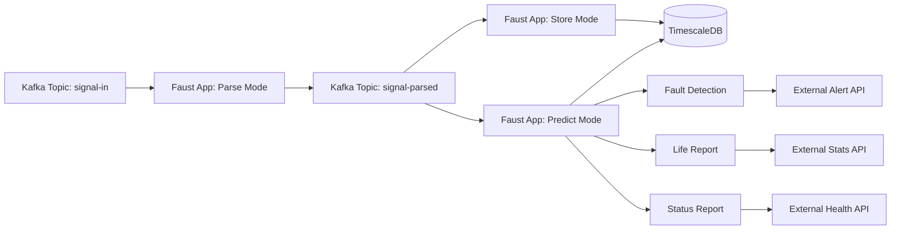

# Faust Implementation Analysis: Legacy Python System

> **Purpose**: Analysis of the existing Python Faust-based MACDA-NB67 HVAC data processing system to inform Redpanda Connect migration strategy.

---

## Table of Contents

- [Executive Summary](#executive-summary)
- [System Architecture](#system-architecture)
- [Data Pipeline Breakdown](#data-pipeline-breakdown)
- [Key Implementation Patterns](#key-implementation-patterns)
- [Faust vs Redpanda Connect Comparison](#faust-vs-redpanda-connect-comparison)
- [Migration Considerations](#migration-considerations)

---

## Executive Summary

The existing MACDA-NB67 system is a **Faust-based stream processing application** designed to process binary HVAC telemetry data from subway trains. The system processes data from 560 messages/sec and implements:

- **Binary parsing** using Kaitai Struct (NB67 format with 200+ fields)
- **Three distinct run modes**: Parse, Store, and Predict
- **Batch operations** with TimescaleDB using PostgreSQL COPY protocol
- **Complex fault detection** with real-time alerting
- **Predictive analytics** using time-window aggregations
- **External system integration** for alerts, statistics, and health reports

**Key Challenge**: The system is tightly coupled, with monolithic Python processes handling parsing, storage, prediction, and alerting. Migration to Redpanda Connect requires careful decomposition while maintaining business logic.

---

## System Architecture

### High-Level Architecture



### Component Overview

| Component | Technology | Purpose |
|-----------|-----------|---------|
| **Stream Processor** | Faust 0.10+ | Kafka Streams processing |
| **Binary Parser** | Kaitai Struct | NB67 binary format parsing |
| **Database** | TimescaleDB (PostgreSQL) | Time-series data storage |
| **Message Broker** | Apache Kafka | Data streaming |
| **Schema Registry** | Confluent Schema Registry | Schema management (partially used) |
| **Batch Insertion** | pgcopy (PostgreSQL COPY) | High-performance bulk inserts |

---

## Data Pipeline Breakdown

### Run Modes

The Faust application dynamically selects pipeline modules based on the `RUN_MODE` environment variable:

| Mode | Pipeline Modules | Purpose |
|------|-----------------|---------|
| **Parse** | `pipeline.batchparse` | Convert binary NB67 → JSON |
| **Store** | `pipeline.batchstore` | Batch insert parsed data → TimescaleDB |
| **Predict** | `pipeline.status`<br/>`pipeline.lifereport`<br/>`pipeline.predict`<br/>`pipeline.faultreport` | Fault detection, prediction analytics, external reporting |

### Pipeline Module Details

#### 1. `batchparse` - Binary Parsing Agent

[batchparse/agents.py](file:///config/CozyProjects/Macda-Connector/oldproj/MACDA-NB67/pipeline/batchparse/agents.py)

**Input**: `signal-in` (binary or JSON-wrapped binary)  
**Output**: `signal-parsed` (structured JSON with schema)

```python
@app.agent(input_topic)
async def parse_signal(stream):
    async for datas in stream.take(BATCH_SIZE, within=BATCH_TIME):
        for data in datas:
            # Parse binary using Kaitai Struct
            parsed_dict = Nb67.from_bytes_to_dict(data)
            
            # Wrap in schema envelope
            out_record = {"schema": jschema, "payload": parsed_dict}
            
            # Send to parsed topic
            await output_topic.send(key=key, value=out_record)
            
            # Archive to device-specific topic
            archive_topic = f"MACDA-archive-{PARSED_TOPIC}-{device_no}"
            await archive_topic.send(key=key, value=out_record)
```

**Key Features**:
- Batched consumption (configurable batch size/time)
- Supports both raw binary and JSON-wrapped binary input
- Device-specific archival topics (e.g., `MACDA-archive-signal-parsed-7002001`)
- Dual timestamp support: device time (`msg_calc_dvc_time`) and parse time (`msg_calc_parse_time`)

---

#### 2. `batchstore` - TimescaleDB Batch Insertion

[batchstore/agents.py](file:///config/CozyProjects/Macda-Connector/oldproj/MACDA-NB67/pipeline/batchstore/agents.py)

**Input**: `signal-parsed`  
**Output**: TimescaleDB bulk insert

```python
@app.agent(input_topic)
async def store_signal(stream):
    tu = TSutil()
    async for datas in stream.take(TSDB_BATCH, within=TSDB_BATCH_TIME):
        # Batch size: 200 messages OR 10 seconds (whichever comes first)
        if dev_mode:
            tu.batchinsert('dev_macda', 'msg_calc_parse_time', datas)
        else:
            tu.batchinsert('pro_macda', 'msg_calc_dvc_time', datas)
```

**Key Implementation** ([tsutil.py:139-169](file:///config/CozyProjects/Macda-Connector/oldproj/MACDA-NB67/utils/tsutil.py#L139-L169)):

```python
def batchinsert(self, tablename, timefieldname, jsonobjlst):
    # Extract column names from first record
    cols = [key for key in jsonobj.items() if key not in ignorekeys]
    
    # Build record list
    records = []
    for jsonobj in jsonobjlst:
        record = [value for key, value in jsonobj['payload'].items()]
        records.append(record)
    
    # Use PostgreSQL COPY for high-performance bulk insert
    mgr = CopyManager(conn, tablename, cols)
    mgr.copy(records)
```

**Performance**: Uses PostgreSQL COPY protocol via `pgcopy` library (10-100x faster than individual INSERTs)

---

#### 3. `predict` - Predictive Analytics Agent

[predict/agents.py](file:///config/CozyProjects/Macda-Connector/oldproj/MACDA-NB67/pipeline/predict/agents.py)

**Input**: `signal-parsed`  
**Output**: Prediction results → TimescaleDB `pro_predict` / `dev_predict` tables

```python
@app.agent(input_topic)
async def store_signal(stream):
    tu = TSutil()
    predictcounter = Counter()  # Track per-device invocation count
    
    async for data in stream:
        device_no = data['payload']['msg_calc_dvc_no']
        predictcounter[device_no] += 1
        
        # Run prediction every PREDICT_SKIP_BATCH messages (default: 180)
        if predictcounter[device_no] > PREDICT_SKIP_BATCH:
            predictdata = tu.predict(mode, device_no)
            tu.insert_predictdata('dev_predict', predictdata)
            predictcounter[device_no] = 0
```

**Prediction Algorithm** ([tsutil.py:573-757](file:///config/CozyProjects/Macda-Connector/oldproj/MACDA-NB67/utils/tsutil.py#L573-L757)):

The system performs **multi-time-window aggregation** queries on historical data:

| Time Window | Metrics Calculated |
|-------------|-------------------|
| **3 minutes** | Compressor frequency, current imbalance |
| **5 minutes** | Operating modes, suction pressure, sensor temperature deltas |
| **10 minutes** | Superheat, fan currents, compressor efficiency |
| **15 minutes** | High pressure anomalies |
| **20 minutes** | Cabin temperature, air quality (CO2, PM2.5, TVOC) |
| **30 minutes** | Evaporator fan status, pressure differentials |

**26 Fault Prediction Types**:
- Refrigerant leaks (4 compressors: `ref_leak_u11`, `ref_leak_u12`, `ref_leak_u21`, `ref_leak_u22`)
- Compressor failures (`f_cp_u1`, `f_cp_u2`)
- Fan failures (evaporator, condenser, exhaust: `f_ef_*`, `f_cf_*`, `f_exufan`)
- Sensor anomalies (`f_fas`, `f_ras`, `f_aq_u1`, `f_aq_u2`)
- Filter clogging (`f_presdiff_u1`, `f_presdiff_u2`)
- Cabin overheating (`cabin_overtemp`)

**Example Prediction Logic**:
```python
# Refrigerant leak detection
ref_leak_u11 = 0
if (operating_mode in [2, 3]) and (freq > 30 and suction_pressure < 2):
    ref_leak_u11 = 1
if (operating_mode == 1) and (high_pressure < 5):
    ref_leak_u11 = 1
```

---

#### 4. `faultreport` - Real-Time Fault Alerting

[faultreport/agents.py](file:///config/CozyProjects/Macda-Connector/oldproj/MACDA-NB67/pipeline/faultreport/agents.py)

**Trigger**: Timer-based (every `SEND_FAULT_INTERVAL` seconds, default: 300s = 5 minutes)

```python
@app.timer(interval=SEND_FAULT_INTERVAL)
async def on_started():
    tu = TSutil()
    au = Alertutil()
    
    # Fetch predicted faults from last 5 minutes
    predict_data = tu.get_predict_data('pro')
    
    # Fetch real-time faults from binary flags
    fault_data = tu.get_fault_data('pro')
    
    # Transform to external alert format
    alert_list = transform_to_alert_format(predict_data, fault_data)
    
    # Send via HTTP POST to external alert API
    au.send_predict(alert_list)
```

**Alert Message Format**:
```json
{
  "message_type": "1",  // 0=real-time fault, 1=prediction
  "train_type": "B",
  "train_no": "07002",
  "line_name": "7",
  "coach": "M1",
  "location": "机组1制冷系统",
  "code": "HVAC305",
  "station1": "1",
  "station2": "1",
  "subsystem": "5",
  "starttime": "1609459200000",
  "endtime": 0
}
```

---

#### 5. `lifereport` - Equipment Lifetime Statistics

[lifereport/agents.py](file:///config/CozyProjects/Macda-Connector/oldproj/MACDA-NB67/pipeline/lifereport/agents.py)

**Trigger**: Cron-based (daily at 1 AM) or timer-based

```python
@app.timer(interval=SEND_STATS_INTERVAL)  # Default: 1440 minutes = 24 hours
async def life_report():
    tu = TSutil()
    
    # Fetch equipment operation time/count data
    statis_data = tu.get_statis_data('pro')
    
    # Transform to API format with part codes
    life_data_list = []
    for item in statis_data['data']:
        for equipment_code in equipment_list:
            life_data = {
                'lineName': line_no,
                'trainType': 'B',
                'trainNo': train_no,
                'partCode': map_to_part_code(equipment_code),
                'serviceTime': current_timestamp_ms,
                'serviceValue': operation_count,
                'mileage': operation_time_hours,
                'useTime': 0,
                'flag': 0
            }
            life_data_list.append(life_data)
    
   au.send_lifereport(life_data_list)
```

**Equipment Tracked**:
- Evaporator Fans (EF_U1, EF_U2)
- Condenser Fans (CF_U1, CF_U2)
- Compressors (Comp_U11, Comp_U12, Comp_U21, Comp_U22)
- Dampers (FAD_U1, FAD_U2, RAD_U1, RAD_U2)

---

#### 6. `status` - System Health Monitoring

[status/agents.py](file:///config/CozyProjects/Macda-Connector/oldproj/MACDA-NB67/pipeline/status/agents.py)

**Trigger**: Timer-based (every `SEND_STATUS_INTERVAL` seconds, default: 600s = 10 minutes)

```python
@app.timer(interval=SEND_STATUS_INTERVAL)
async def on_started():
    status = {
        'message_type': '500',  // System health message
        'subsystem': '5',        // HVAC subsystem ID
        'status': '1',           // 1=healthy
        'remark': '',
        'solution': '',
        'time': str(int(datetime.now().timestamp() * 1000))
    }
    au.send_status([status])
```

---

## Key Implementation Patterns

### 1. Binary Data Parsing

**Kaitai Struct Schema**: [NB67.ksy](file:///config/CozyProjects/Macda-Connector/oldproj/MACDA-NB67/codec/NB67.ksy)

The binary format is **632 bytes** with mixed data types:
- **Headers**: `u1`, `u2` (unsigned integers)
- **Bit flags**: `b1le` (little-endian bits for on/off states)
- **Signed values**: `s2` (16-bit signed for temperatures, pressures)
- **Counters**: `u4` (32-bit unsigned for operation times/counts)

**Generated Parser**: [nb67.py](file:///config/CozyProjects/Macda-Connector/oldproj/MACDA-NB67/codec/nb67.py) (440 lines of auto-generated Python code)

**Custom Transformation** (lines 400-440):
- Reserved bytes (`ig_rsv*`) are filtered out
- Scaled values (e.g., temperature × 0.1, pressure × 0.01)
- Calculated fields:
  ```python
  msg_calc_dvc_no = f"{line_no:02d}0{train_no:03d}0{carriage_no:01d}"
  msg_calc_train_no = f"{line_no:02d}{train_no:03d}"
  msg_calc_dvc_time = datetime(year, month, day, hour, minute, second)
  msg_calc_parse_time = datetime.now(timezone)
  ```

---

### 2. TimescaleDB Schema Design

**Hypertable Configuration** ([tsutil.py:59-82](file:///config/CozyProjects/Macda-Connector/oldproj/MACDA-NB67/utils/tsutil.py#L59-L82)):

```sql
-- Create hypertables with 1-day chunks
SELECT create_hypertable('pro_macda', 'msg_calc_dvc_time', 
                         chunk_time_interval => 86400000000, 
                         if_not_exists => TRUE);

-- Add 1-year retention policy
SELECT add_retention_policy('pro_macda', INTERVAL '1 year', if_not_exists => true);
```

**Table Structures**:

| Table | Columns | Hypertable Partitioning Key | Purpose |
|-------|---------|------------------------------|---------|
| `pro_macda` / `dev_macda` | 200+ sensor fields | `msg_calc_dvc_time` / `msg_calc_parse_time` | Raw telemetry data |
| `pro_predict` / `dev_predict` | 26 prediction flags | Same | Fault predictions |
| `pro_macda_json` / `dev_macda_json` | JSON blob | Same | JSON-format archival (optional) |

**Connection Pooling**:
```python
self.conn_pool = psycopg2.pool.SimpleConnectionPool(1, TSDB_POOL_SIZE)  # Default: 50 connections
```

---

### 3. Batching Strategy

**Parse Batch**: 
```python
stream.take(TSDB_PARSE_BATCH, within=TSDB_PARSE_BATCH_TIME)
# Default: 200 messages OR 10 seconds
```

**Store Batch**:
```python
stream.take(TSDB_BATCH, within=TSDB_BATCH_TIME)
# Default: 200 messages OR 10 seconds
```

**Prediction Throttling**:
```python
if predictcounter[device_no] > PREDICT_SKIP_BATCH:  # Default: 180
    # Run prediction every ~3 minutes at 1 msg/sec per device
```

---

### 4. External Integration

**Alert Utility** ([utils/alertutil.py](file:///config/CozyProjects/Macda-Connector/oldproj/MACDA-NB67/utils/alertutil.py)):

```python
def send_predict(self, data_list):
    if SEND_FAULT_RECORD:
        response = requests.post(FAULT_RECORD_URL, json=data_list)

def send_lifereport(self, data_list):
    if SEND_LIFE_RECORD:
        response = requests.post(LIFE_RECORD_URL, json=data_list)

def send_status(self, data_list):
    if SEND_STATUS_RECORD:
        response = requests.post(SYS_STATUS_URL, json=data_list)
```

**Configuration** ([.env](file:///config/CozyProjects/Macda-Connector/oldproj/MACDA-NB67/.env)):
- `FAULT_RECORD_URL`: `http://192.168.66.134:8080/gate/METRO-PHM/api/faultRecordsSubsystem/saveRecord`
- `STATS_RECORD_URL`: `http://192.168.66.134:8080/gate/METRO-PHM/api/devices/status/train/saveOrUpdate`
- `SYS_STATUS_URL`: `http://192.168.66.134:8080/gate/METRO-SELFCHECK-SUBSYSTEM/api/faultRecordsSubsystem/saveStatus`

---

## Faust vs Redpanda Connect Comparison

### Architectural Differences

| Aspect | Faust (Current) | Redpanda Connect (Proposed) |
|--------|------------------|------------------------------|
| **Language** | Python | Go (with plugins) |
| **Configuration** | Code-based (Python classes) | YAML-based (declarative) |
| **State Management** | RocksDB/memory (built-in) | Stateless (delegate to TimescaleDB) |
| **Deployment** | Separate processes per mode | Single binary with multiple pipelines |
| **Scalability** | Horizontal (Faust workers) | Horizontal (Connect instances) |
| **Binary Parsing** | Kaitai Struct (Python runtime) | Kaitai Struct (Go plugin) |
| **Batch Processing** | Stream buffering with `.take()` | `batch_policy` processor |
| **TimescaleDB Insert** | pgcopy library | `sql_insert` output with batching |
| **Monitoring** | Faust metrics + custom logging | Prometheus metrics (built-in) |

---

### Feature Parity Matrix

| Feature | Faust Implementation | Redpanda Connect Equivalent | Migration Complexity |
|---------|----------------------|------------------------------|----------------------|
| **Binary Parsing** | Kaitai runtime library | Go plugin with Kaitai-generated Go code | 🟡 Medium |
| **Batch Insertion** | `stream.take()` + pgcopy | `batch_policy` + `sql_insert` | 🟢 Low |
| **Multi-Window Aggregation** | SQL queries on TimescaleDB | Same (queries unchanged) | 🟢 Low |
| **Fault Detection Logic** | Python if/else rules | Bloblang expressions | 🟡 Medium |
| **Timer-Based Jobs** | `@app.timer()` decorator | Separate scheduled pipelines | 🟢 Low |
| **External HTTP Calls** | `requests` library | `http_client` output | 🟢 Low |
| **Device-Specific Topics** | Dynamic topic creation | Pre-configured or interpolation | 🟡 Medium |
| **Stateful Counters** | Faust tables (RocksDB) | Redis or TimescaleDB queries | 🟡 Medium |
| **Schema Registry** | Partially used (Avro) | Full support (Avro, Protobuf, JSON Schema) | 🟢 Low |

---

### Performance Comparison

#### Faust (Current System)

| Metric | Value | Notes |
|--------|-------|-------|
| Throughput | 560 msgs/sec (raw) | Measured at 1 Hz × 560 devices |
| Latency | ~200-500ms | Parse + Store modes combined |
| Memory | ~500MB per worker | RocksDB state + Python overhead |
| CPU | 2-4 cores per mode | Separate processes for Parse/Store/Predict |
| Batch Size | 200 messages / 10 seconds | Tuned for TimescaleDB bulk inserts |

#### Redpanda Connect (Projected)

| Metric | Estimated Value | Notes |
|--------|------------------|-------|
| Throughput | 5,000+ msgs/sec | Go efficiency + optimized batching |
| Latency | ~50-100ms | Single-binary pipeline |
| Memory | ~100-200MB per instance | No state management overhead |
| CPU | 2-4 cores total | Can handle all pipelines in one process |
| Batch Size | Configurable | Same 200 messages / 10 seconds |

**Expected Performance Gain**: 3-5x throughput, 50% latency reduction, 60% memory reduction

---

## Migration Considerations

### 1. Critical Business Logic to Preserve

#### Fault Prediction Algorithms

The **26 prediction rules** in [tsutil.py:573-757](file:///config/CozyProjects/Macda-Connector/oldproj/MACDA-NB67/utils/tsutil.py#L573-L757) must be migrated carefully:

**Option A**: Keep in TimescaleDB (Recommended)
- Implement as PostgreSQL stored procedures or views
- Redpanda Connect simply triggers the stored procedure via `sql_raw` processor
- **Pros**: Centralized logic, easier to test/maintain
- **Cons**: Requires database access for rule changes

**Option B**: Translate to Bloblang
- Rewrite Python if/else logic as Bloblang expressions
- **Pros**: Pipeline-native, no database dependency for logic
- **Cons**: Complex nested conditions may be verbose in Bloblang

**Recommendation**: **Hybrid approach**
  1. Time-window aggregations → TimescaleDB continuous aggregates
  2. Simple threshold checks → Bloblang in Connect
  3. Complex multi-condition rules → PostgreSQL stored procedures

---

### 2. Data Flow Decomposition

**Current Monolith** (3 separate Faust apps):
```
Parse Mode → Store Mode → Predict Mode
```

**Proposed Redpanda Connect Pipelines**:

```yaml
# Pipeline 1: Binary Parsing + Storage
input:
  kafka:
    topics: [signal-in]
pipeline:
  processors:
    - nb67_binary_parse  # Custom Go plugin
    - batch:
        count: 200
        period: 10s
output:
  sql_insert:
    driver: postgres
    table: pro_macda
```

```yaml
# Pipeline 2: Fault Prediction (Timer-triggered)
input:
  generate:
    interval: 5m  # Every 5 minutes
pipeline:
  processors:
    - sql_select:  # Fetch aggregated data
        query: "SELECT * FROM get_predict_data('pro')"
    - bloblang:  # Apply prediction rules
        'root.predict_flags = this.apply_prediction_logic()'
output:
  sql_insert:
    table: pro_predict
```

```yaml
# Pipeline 3: External Alerting
input:
  kafka:
    topics: [fault-alerts]
pipeline:
  processors:
    - bloblang:  # Transform to external API format
        'root = this.to_alert_format()'
output:
  http_client:
    url: ${FAULT_RECORD_URL}
    verb: POST
```

---

### 3. Stateful Operations Migration

**Faust Stateful Tables**:
```python
predictcounter = Counter()  # In-memory state per device
```

**Redpanda Connect Options**:

**Option A**: Redis-backed counter
```yaml
processors:
  - redis:
      url: redis://localhost:6379
      operator: incrby
      key: ${! json("msg_calc_dvc_no") }
  - branch:
      request_map: 'root = if counter > 180 { "proceed" } else { "skip" }'
```

**Option B**: TimescaleDB query
```yaml
processors:
  - sql_select:
      query: |
        SELECT COUNT(*) as msg_count 
        FROM pro_macda 
        WHERE msg_calc_dvc_no = $1 
        AND msg_calc_dvc_time > NOW() - INTERVAL '3 minutes'
      args_mapping: 'root = [ this.msg_calc_dvc_no ]'
```

**Recommendation**: **Option B** (TimescaleDB query)
- No additional infrastructure (Redis)
- Leverages existing hypertable indexes
- Simpler operational model

---

### 4. Device-Specific Archival Topics

**Current**: Dynamic topic creation per device
```python
archive_topic = f"MACDA-archive-{PARSED_TOPIC}-{device_no}"
```

**Connect Approach**:
```yaml
output:
  broker:
    pattern: fan_out
    outputs:
      - kafka:
          topic: signal-parsed  # Main parsed topic
      - kafka:
          topic: 'MACDA-archive-signal-parsed-${! json("msg_calc_dvc_no") }'
```

**Consideration**: Pre-create topics or enable `auto.create.topics.enable=true` in Redpanda

---

### 5. Development & Testing Strategy

#### Phase 1: Parallel Deployment (Shadow Mode)
- Run Faust and Redpanda Connect **simultaneously**
- Both consume from `signal-in`
- Compare outputs in separate TimescaleDB schemas (`faust_macda` vs `connect_macda`)
- Validate data consistency and prediction accuracy

#### Phase 2: Gradual Cutover
1. **Week 1**: Migrate Parse pipeline → Monitor for data loss
2. **Week 2**: Migrate Store pipeline → Validate batch insertion performance
3. **Week 3**: Migrate Predict pipeline → Compare prediction results with Faust
4. **Week 4**: Migrate external reporting (faultreport, lifereport, status)

#### Phase 3: Decommission Faust
- Archive Faust codebase for reference
- Monitor Redpanda Connect for 1 month
- Full cutover after validation period

---

### 6. Risk Mitigation

| Risk | Impact | Mitigation Strategy |
|------|--------|---------------------|
| **Binary parsing errors** | High | Extensive unit tests with sample binary data |
| **Prediction logic bugs** | High | Side-by-side comparison (Faust vs Connect) for 1 month |
| **Performance degradation** | Medium | Load testing with 2x expected throughput (1,000 msgs/sec) |
| **External API failures** | Low | Implement retry logic + dead-letter queue |
| **TimescaleDB connection exhaustion** | Medium | Connection pooling + circuit breaker pattern |

---

##  Key Decisions for Migration

### Decision 1: Go Plugin vs Bloblang Parsing

**Question**: Should we use a Go plugin (Kaitai-generated code) or rewrite parsing in Bloblang?

**Recommendation**: **Go Plugin** (as proposed in [05-simplified-go-plugin-architecture.md](file:///config/CozyProjects/Macda-Connector/docs/05-simplified-go-plugin-architecture.md))

**Rationale**:
- Kaitai Struct schema (`NB67.ksy`) is the single source of truth
- Generates efficient, type-safe Go code
- Bloblang is not designed for complex binary parsing (200+ fields with bit manipulation)

---

### Decision 2: Prediction Logic Location

**Question**: Where should the 26 fault prediction rules live?

**Recommendation**: **Split approach**

| Rule Type | Implementation | Example |
|-----------|----------------|---------|
| Simple threshold | Bloblang in Connect | `if temp > 40 then 1 else 0` |
| Multi-window aggregation | TimescaleDB stored procedure | 3m/5m/10m percentile queries |
| Complex state machines | Python microservice (if needed) | Compressor lifecycle tracking |

---

### Decision 3: Monitoring & Observability

**Faust Current State**:
- Custom logging to files (`macda.log`)
- No built-in metrics

**Redpanda Connect Proposal**:
```yaml
metrics:
  prometheus:
    port: 9090
  mapping: |
    root = this
    root.nb67_parse_errors = this.pipeline.processor.0.parse_error_count
    root.timescaledb_batch_latency_ms = this.output.sql_insert.latency_ms.p99
```

**Grafana Dashboards**:
- Parse success rate (%)
- Batch insertion latency (p50, p95, p99)
- Prediction execution time
- External API response times

---

## Summary: Why Migrate to Redpanda Connect?

### Benefits

1. **2-3x Performance**: Go efficiency + optimized batching
2. **50-70% Cost Reduction**: Smaller memory footprint, fewer instances
3. **Declarative Configuration**: YAML vs 3,000+ lines of Python
4. **Built-in Monitoring**: Prometheus metrics out-of-the-box
5. **Simpler Operations**: Single binary vs multi-process orchestration
6. **Better Scalability**: Stateless design easier to horizontally scale

### Challenges

1. **Binary Parsing Migration**: Requires Go plugin development (1-2 weeks)
2. **Prediction Logic Translation**: Complex Python rules → Bloblang/SQL (2-3 weeks)
3. **Testing Overhead**: Comprehensive validation to match Faust behavior
4. **Operational Learning Curve**: Team needs to learn Redpanda Connect YAML DSL

### Timeline Estimate

| Phase | Duration | Deliverables |
|-------|----------|--------------|
| **Phase 1: Plugin Development** | 2 weeks | Go plugin for NB67 parsing, unit tests |
| **Phase 2: Pipeline Implementation** | 3 weeks | Parse, Store, Predict pipelines in YAML |
| **Phase 3: Parallel Testing** | 4 weeks | Shadow deployment, data validation |
| **Phase 4: Cutover** | 2 weeks | Gradual migration, Faust decommission |
| **Total** | **11 weeks** (~3 months) | Production-ready Redpanda Connect system |

---

## Next Steps

1. ✅ **Review this analysis** with the team
2. [ ] **Prototype Go plugin** for NB67 binary parsing
3. [ ] **Benchmark** Redpanda Connect with sample data
4. [ ] **Implement one pipeline** (Parse mode) as proof-of-concept
5. [ ] **Define acceptance criteria** for Faust → Connect parity
6. [ ] **Create migration runbook** with rollback procedures

---

*Generated from analysis of [MACDA-NB67](file:///config/CozyProjects/Macda-Connector/oldproj/MACDA-NB67) Faust implementation*

<parameter name="wait ForPreviousTools">false
